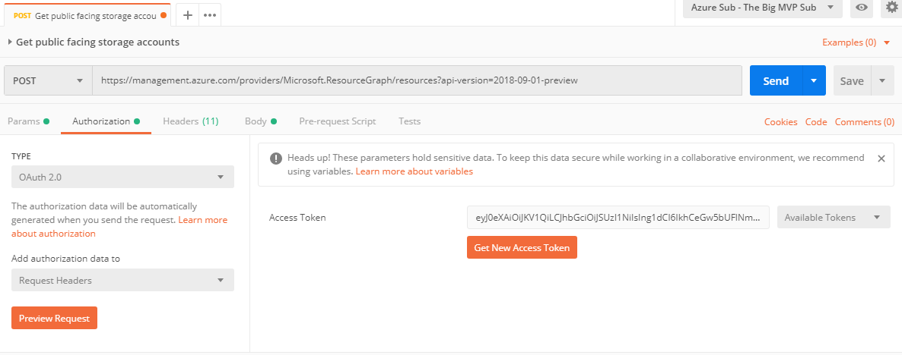
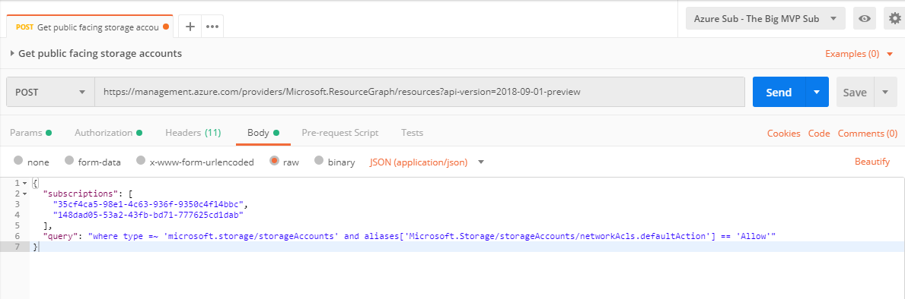
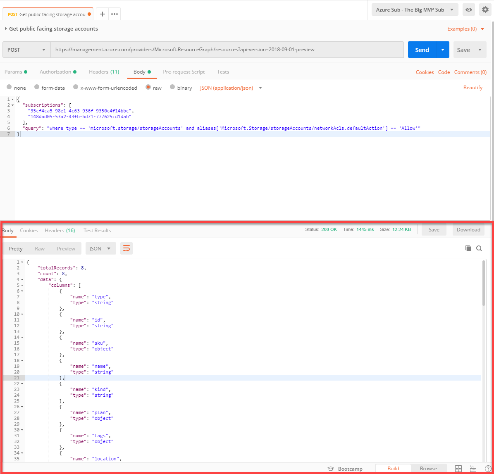

# Invoke Azure Resource Graph API using Postman

## Introduction
Postman is a popular API development tool among developers. You can download it for free at its website [https://www.getpostman.com](https://www.getpostman.com). Postman can be used to invoke Azure Resource Manager (ARM) REST APIs.

## Instructions
### Pre-requisites
To use Postman with ARM REST APIs, you will firstly need to create an Azure AD application with service principal for Postman. You will need to give this Service Principal sufficient Azure RBAC permissions to invoke the API calls that you intended to make. Tao Yang has written a blog post on how to configure Postman to invoke ARM API calls: [https://blog.tyang.org/2017/04/26/using-postman-invoking-azure-resource-management-apis/](https://blog.tyang.org/2017/04/26/using-postman-invoking-azure-resource-management-apis/)
>**NOTE:** Although the post is few years old and it was using the old Azure ASM portal, you should still be able to use it as a reference.

### Invoking Resource Graph Queries
1. Enter request URL - ***https://management.azure.com/providers/Microsoft.ResourceGraph/resources?api-version=2018-09-01-preview***
2. Select HTTP method - ***POST***
3. Generate and insert oAuth token to the request header

4. Construct request body (as explained in [Azure Resource Graph REST API](ARM-REST-API.md))

5. Click **Send** button to invoke the request
6. Result is displayed in the response body section
