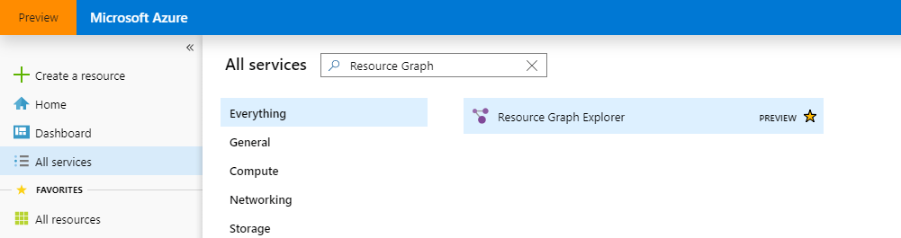
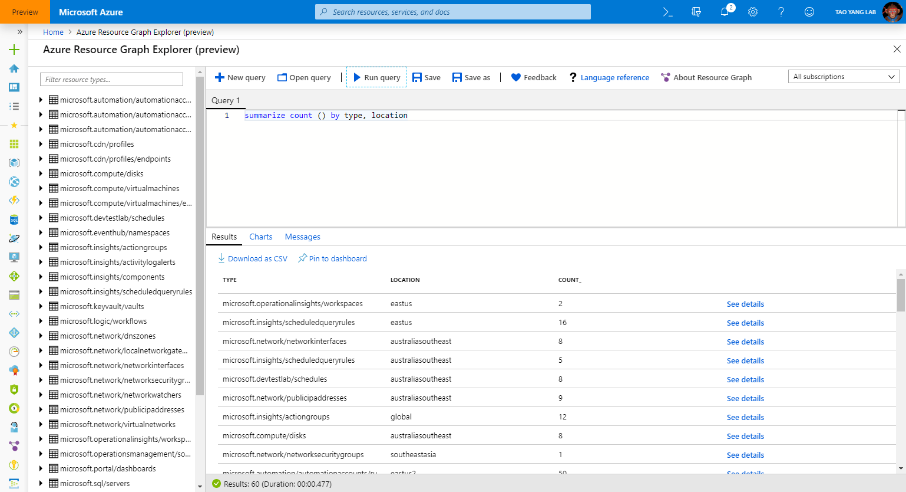

# Azure Resource Graph Explorer

## Introduction
Azure Resource Graph Explorer is a Graphical User Interface (GUI) for [Azure Resource Graph](https://azure.microsoft.com/en-us/features/resource-graph/), that is built inside of Azure portal.

> NOTE: Currently (April 2019), The Azure Resource Graph Explorer is still in early preview, it is not available in the production Azure portal, but instead, you can find it at the Azure Preview portal ([https://preview.portal.azure.com](https://preview.portal.azure.com)).

## Instruction
You can locate the Resource Graph Explorer from the All Services blade by searching "Resource Graph Explorer" as shown below:

Once you have launched the Resource Graph Explorer, you can invoke Resource Graph queries and export results (as shown below):

