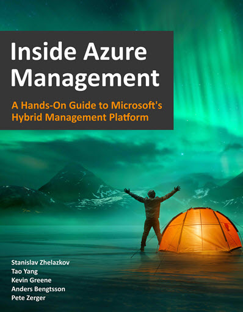

# Azure Resource Graph Collection

## Description
This repository contains my Collection of Azure Resource Graph related resources such as sample scripts and Resource Graph Queries.

## How-To
The following pages demonstrate how to invoke Azure Resource graph queries via different methods.
#### Command-line Interfaces (CLI)
The following code samples demonstrates how to invoke Azure Resource Graph queries using using CLI:
* [PowerShell](How-To/PowerShell.md)
* [Azure CLI](How-To/AzureCLI.md)

#### Azure Resource Manager (ARM) REST API
The following page demonstrate how to invoke Azure Resource Graph queries using Azure Resource Manager (ARM) REST API:
* [ARM REST API](How-To/ARM-REST-API.md)

#### Azure Resource Graph Explorer
The following page demonstrate how to use the Azure Resource Graph Explorer within the Azure portal:
* [Azure Resource Graph Explorer](How-To/Resource-Graph-Explorer.md)

#### Sample Scripts
Collection of PowerShell scripts around Azure Resource Graph:
* [PowerShell Script](How-To/PS-Scripts.md)

#### Postman
The following page demonstrate how to invoke the Resource Graph REST API via Postman
* [Postman](How-To/Postman.md)

## Sample Queries
The sample queries are grouped into the following categories:
* [General](Queries/General.md)
* [Compute](Queries/Compute.md)
* [Monitoring](Queries/Monitoring.md)
* [Storage](Queries/Storage.md)
* [Networking](Queries/Network.md)
* [SQL Server](Queries/SQL_PaaS.md)
* [SQL Managed Instance](Queries/SQL_MI.md)

## References
#### Inside Azure Management book

Azure Resource Graph is explained in details in chapter 2 of the Inside Azure Management book. This book can be downloaded at:
* [Download Inside Azure Management book](https://bit.ly/InsideAzureMgmt)

#### Microsoft documentation site
Official documentation can be found at: [https://docs.microsoft.com/en-us/azure/governance/resource-graph/](https://docs.microsoft.com/en-us/azure/governance/resource-graph/)